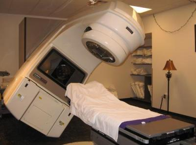

# Therac-25 accidents

Therac-25 is a X-Ray radiation therapy machine build in 1982. It has 2 main ancestors on principle of which new model was constructed. The purpose of those machines was to cure cancer through burning out cancer tumor with a high intense radiation beam. This machine was involved in 6 accidents in which 4 patients have died and 2 were very severely injured. During this blog-post we're going to focus on answering 3 important questions: "What have happened?", "Why it happened?" and the most important "Why should you care?".

## What have happened?

In order to explain what have happened we have to take a closer look at the history of machine design. Since machine was not the first one build, it is really important to understand principle of operation of its ancestors.

#### History of Therac-25 ancestors

Therac-25 was manufactured by Atomic Energy of Canada Limited (AECL). It was a third radiation therapy machine by the company and the first build without partnership with CGR, a french company. Even though partnership had dissolved AECL was still be able to access and use resources of this particular project. Therac-20 codebase was developed using Therac-6. All 3 machines were running on the PDP-11 computer, but in case of Therac-6 and Therac-20 they were designed to work as a stand alone devises. There was two main principle of operation: manual and electron. As you've probably guessed Therac-6 and Therac-20 could be used in manual mode without computer attached to the system. The principle was simple: radiotherapy technician would set up physically different parts of machine in the right position including 3 main components in the path of radiation beam. In electron mode, scanning magnets was used to spread the beam out and to cover a larger area. In X-ray mode the target was placed in front of electron beam to strike it and then to produce X-ray photons directed to the patient. Also, there was a mirror which could be placed in front of the electronic beam. The electron beam would never switch on if the mirror was in place.

On Therac-6 and it's next version Therac-20, hardware interlocks were responsible not to allow the system to do something dangerous. For example to selecting a high power electron beam without the x-ray target in place. The PDP-11 was used to speed up the process of setting the system to a new session of treatment which was quiet surprisingly good at that time. Since the cost of machine was in terms of millions of dollars that additional boost of speed was really important for daily treatment.

When AECL started to design new model Therac-25 they decided to go with computer control only. They removed hardware interlocks with a software one thus making patient treatment and safety fully dependent on software which was running radiation therapy machine.

#### Accidents

1. Therac-25 went into service in 1983. For several years and thousands of patients everything was fine until on June 3, 1985 a women being treated for breast cancer received an overdose of radiation. As it was discovered later she received somewhere between 10000 and 20000 instead of 200 Radiation Absorbed Dose.
2. The second accident occurred on 26 July. Patient was burned and died the same year in November.
3. In December of 1985, a third woman was burned by a Therac-25 installed in Yakima, Washington. She lived, but she needed skin grafts to close the wounds caused by radiation burns.
4. On March 21, 1986, a patient in Tyler, Texas was scheduled to receive his 9th Therac-25 treatment. He was prescribed 180 rads to a small tumor on his back, but after a huge overdose he was hospitalized for radiation sickness, and died 5 months later.
5. On April 11th, 1986, the second accident occurred in Tyler, Texas. Patient was being treated for skin cancer on his ear. He said that it felt like his face was on fire. Three weeks later he died due to radiation burns on the right temporal lobe.
6. On January, 1987 the last accident occurred and patient died due to radiation injuries.

#### Investigation

After first accident AECL denied that Therac-25 could deliver an overdose of radiation. They said that machine has so many safe guards that it is literally impossible that such kind of accident could happen. After next accident it was clear that something is wrong and that the problem is indeed in the radiation therapy machine. They have noticed that machine is constantly throwing some errors. AECL carefully tested to reproduce those errors, but they failed to do that. The only way this kind of overdose could happen is if the turnable was not in the right position. Thus, the X-ray target would not be on the electronic beam path and would hit directly patient. AECL never published the source of the code. When a couple of experts received access to the codebase they found that the whole code was written by one programmer which had no experience in real-time systems. They haven't found any timing analysis which is exceedingly important in real-time systems. Programmer no longer was working for the company and could not be found.

## Why it happened?

Knowing that codebase was almost inherited from Therac-25 ancestors we now can explain why those accidents occurred. It is important to mention that AECL were testing carefully the system, but the problem was that due to the nature of the bug it was nearly impossible to reproduce it. There was a really small chance that it could happen. The software reliability modeling was not considered during the design of a new model Therac-25. As it was mentioned before programmer which wrote software had no time in real-time systems, thus he was not aware of the principles of concurrent programming. There are a lot of examples nowadays which illustrates how wrong could code things if you're building concurrent systems. In Therac-25 there was a lot of root causes, but I would like to focus on the one which is always covered today and was not covered back when software for Therac-25 was designed. The equipment control task, which was responsible for example for setting electronic beam target, was not properly synchronized with the operator interface task. That means, in terms of  
concurrent programming, that race condition can occur. For those of you who don't know race condition is a software or electronic behavior in which the output is dependent on the sequence or timing of other uncontrollable events. At this point you should be able to understand what kind of critical software bug experts have found when they opened the source code of the Thera-25. In real-time systems timing is exceedingly important and when there is no timing handling that means that system fail is just a matter of time to occur. That also was the problem when AECL was testing behavior of machine after accidents and they couldn't find a single prove of the wrong functionality of the system.

## Why should you care?

Well, there are plenty of examples in Computer Science history in which software or actually developers who wrote software caused severe consequences. Therac-25 accident is one of the most studied one. It shows us how important is to study principles of any software development, how important is to test in in proper way and to make sure that every line of code which is running in production was received by several developers and by testing team so that no critical bug would cause that kind of consequences as Therac-25 did. I strongly suggest to take a look at concurrent programming principles, because today it is almost present in every peace of software. It would be a great idea to write yourself, as did I, a small multithreading counter program to see yourself how unpredictable software could behave under certain conditions. If you did get to this point in my blog I'm really surprised and would appreciate if you would live a comment down bellow.

## References

<https://www.youtube.com/watch?v=nxX-aAvZbmM>
<http://hackaday.com/2015/10/26/killed-by-a-machine-the-therac-25/>
<http://courses.cs.vt.edu/professionalism/Therac_25/Therac_1.html>
<https://en.wikipedia.org/wiki/Therac-25>
<https://en.wikipedia.org/wiki/Race_condition>

For those of you how are really interested by Concurrent and Distributed Programming check out this link:

<https://www.cs.vassar.edu/_media/courses/cs377-201603/slides.pdf>
