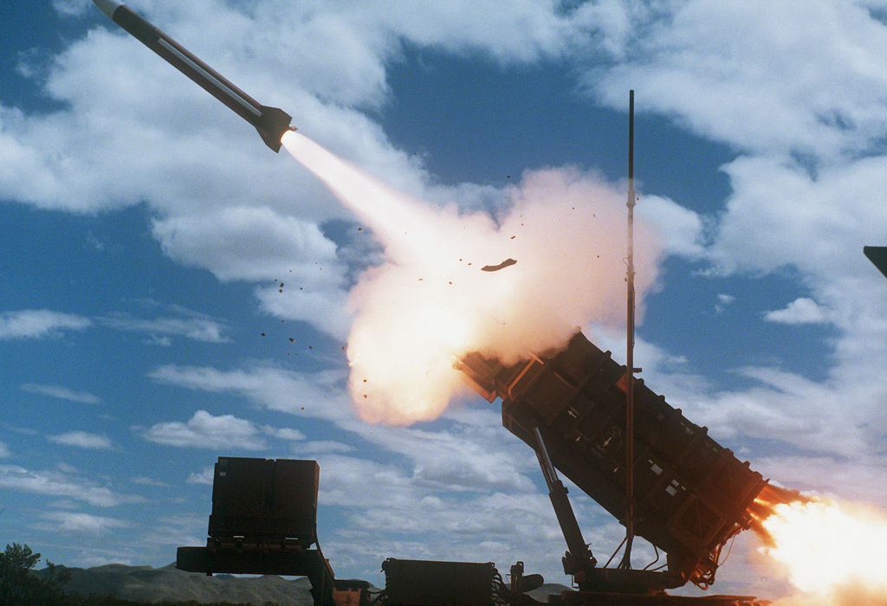

Nowadays Computer Science is a primary source of innovation in all fields and areas of expertise. We so hardly relay on computer's calculation power that we even forget that it's limited. We have to be aware of the weak points of architectures we are building especially when we are dealing with human lives. Let's take a concrete example and walk you throw to show how could a single bug in software architecture cause dozens of deaths.

# Patriotic Missile Failure

On February 25, 1991, during the Gulf War, an American Patriot Missile battery in Dharan, Saudi Arabia, failed to track and intercept an incoming Iraqi Scud missile. Missile struck an American Army barracks, killing 28 solders and injuring around 100 other people. In order to understand how could it happened at that day, and not the day before or a month before we have to take a closer look on what was so unusual in that specific day? The answer is: "The battery was active for more than 100 hours". Two weeks before the accident acquired Saudi Arabia reported to the defense department that the system was losing time and it should not be leaved on for a long time, but they haven't mentioned what do they mean by saying "long time". It turns out that internal clock of the system was multiplied by 1/10 to produce time since boot of the system. What's so special about this number?

## Data storing error

Any computer is storing data in registers and they are of specific size. Binary expansion of some numbers can't be stored exactly in any system even nowadays. Let's remember from math what is the value of 1/3. It is: 0.333333333... and so on it goes forever. Coming back to our number 1/10 it's binary expansion is: 0.0001100110011... and also so on it goes forever. Thus, as our storing data registers are of limited amount of digits it can handle that means the number can't be stored exactly and it will always have an error depending on the length of register we will use. In Patriot Missile battery system was used 24 bit fixed point registers and in which 1/10 would look like this: 0.00011001100110011001100 introducing an error of   0.0000000000000000000000011001100... in binary or about 0.000000095 decimal. For 100 hours of work we would have an error of:  100x60x60x10x0.000000095=0.34 s.  

## Principle of work

Patriotic battery was a system build to intercept incoming Scuds by predicting it's new location and firing it's own missile to intercept enemy's one. The system is using highly precise calculations meaning that any error is inadmissible. Thus, as we've seen in previous chapter data conversion and storing is a really important concept which should have been covered by software engineers.

So, having an error of 0.34s and the speed of Scud which is about 1676 m/s we have an error of position 569.84 m, which is a huge.

## Why should you care?

Floating point number storing was, and will be an issue we have to be aware of when building high precision systems which involve calculations with floating point numbers. We have to know how to detect and avoid such bugs.

## References

<http://www.math.umn.edu/~arnold/disasters/patriot.html>
<https://www.youtube.com/watch?v=JZPirNkLPBY>
